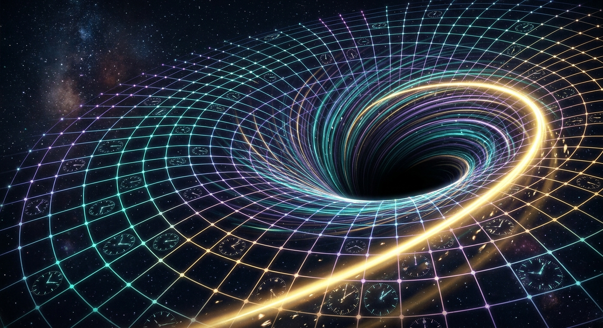
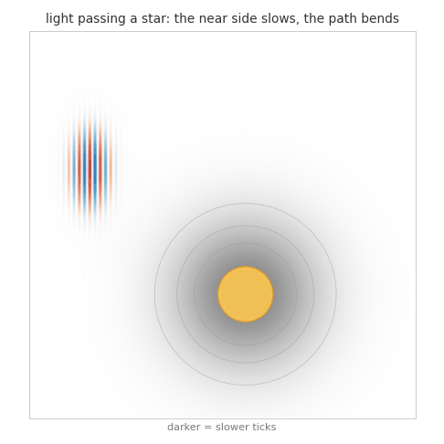
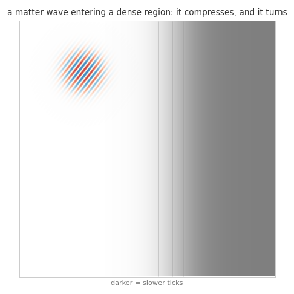
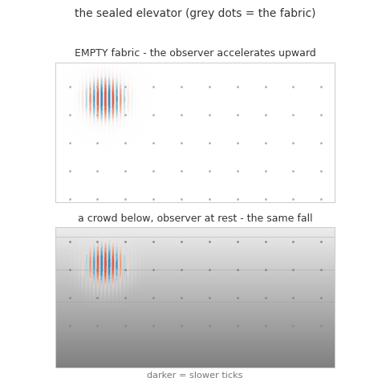
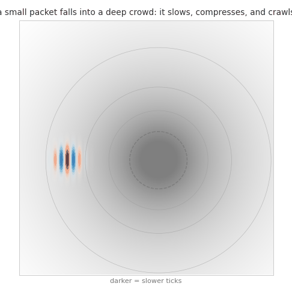

# No Waves, No Spacetime

*Quest for Entropy #15: in a toy universe, spacetime is something that happens to waves — gravity as a crowd, time as a budget, and at the bottom of the crowd a black hole with no singularity.*

## The question

> The Paper: [paper/the-iceberg-model.md](https://github.com/questforentropy/iceberg-model/blob/main/paper/the-iceberg-model.md)

Last episode we locked a virtual cat in Schrödinger's box and got superposition out of a programming construct every developer uses daily. This time I had planned to present the most popular mystery object in physics: the black hole.

The black hole is here — it closes the episode. But while building its pictures, I understood something that deserves the headline more than the hole does. In our toy universe, spacetime — the bending, the slowing, the falling, the whole show — is not installed anywhere. There is no geometry in the code. No metric, no force law, no gravity knob. And yet clocks slow near matter and light bends around it, on camera.

The catch is the title. All of it happens only to waves. Hand the same universe a tiny billiard ball and it feels nothing. No gravity, no time dilation, no black hole. For a stone, there is no spacetime at all.

So this episode is a mechanism story in three acts: what waves are in the machine, what a crowd of them does to a wave, and what sits at the bottom of the deepest crowd. The numbers exist — every row is listed at the end — but I will keep them out of the way. The point of this piece is not that a laptop matched an astronomy figure. It is that one boring mechanism produces the whole zoo.

## Waves in the Iceberg

The machine, retold in one breath. The visible layer of the Iceberg Model ([episode #13](https://questforentropy.substack.com/p/the-iceberg-model)) is a sprinkle of compute nodes — randomly spread, connected to neighbors, each with a fixed budget of processing per tick. Nothing else is given. And everything that lives on the nodes is a wave, hopping node to node: light is a wave, radiation is a wave, and — following de Broglie — matter is a wave too. There are no little balls anywhere. Waves are the only residents.

The fixed budget is the whole plot. Watch what it does to the two postures a wave can take.

**An unfolded wave — light.** It spends every tick on motion: one hop per local tick, the fastest its neighborhood allows. That local maximum is the speed of causality — the thing we call the speed of light. Nothing is left over for internal life, so a free wave has no internal clock: from the photon's side, no time passes at all. And no internal pacing is what this model means by "no mass."

**A folded wave — matter.** Fold the same kind of wave up in one place — a standing pattern, evolving against itself — and the budget flows inward instead: the pattern's internal circulation is its clock, its aging, its mass. Set it moving and the ticks must split. Whatever goes to carrying the pattern across nodes is missing from the circulation inside, so a moving clock ticks slower. Not by decree — by bookkeeping. (How exactly the pacing ties to mass is *installed* in the model, not derived. Confession section, as always.)

One wave, two postures. Unfolded, it is light: all motion, no time. Folded, it is matter: all time, until it moves. Every "relativistic effect" in this episode is the same coin spent two ways.

**And a crowd.** Now pack many waves into one region — in practice folded ones, the ones that stay. They all draw on the same nodes, and a node's budget does not grow. So the whole neighborhood runs late — every clock there ticks slower, and even a clock hovering in *empty* space nearby slows, because congestion spreads through the fabric the way load spreads through a data center. Gravity, in this model, is not a force. It is a crowd.

## No waves, no spacetime

Here is the measurement that gave this episode its title, and I keep turning it over.

We handed the model a point particle — a genuine little billiard ball, position and velocity, no wave nature at all — and sent it through the same crowded region that bends every wave. It sailed through dead straight. Released at rest beside the crowd, it did not begin to fall. Meanwhile a wave packet released at the same spot fell toward the crowd the way a dropped stone should.

It took me a while to say this precisely: gravity did not fail to be *strong enough* for the point particle. Gravity failed to *exist* for it. A slow region can only matter to something extended enough to feel one side lag behind the other — and a point has no sides. So in this toy universe, spacetime is not a stage that objects stand on. It is a property of the runners. It emerges if, and only if, the things that run on the nodes are waves.

Which would be a devastating objection to the whole model — except for the strangest well-measured fact about our own universe: everything ever put to the wave test passes. Light, obviously. Electrons — "point-like" in every table, no substructure ever found — diffract like waves, measured since 1927. Neutrons do. Atoms do. Interferometers have done it with molecules of two thousand atoms. De Broglie's 1924 idea — every piece of matter is a wave — is not an interpretation; it is an instrument that has never failed. In this model, de Broglie is not decoration. He is a load-bearing wall: matter *must* be a wave, because a universe of billiard balls would have nothing for gravity to grab.

And the real world has already run the model's favorite experiment on real matter waves. In 1975, Colella, Overhauser and Werner flew neutrons through a two-arm interferometer, one arm slightly higher than the other, and read Earth's gravity directly off the *phase* of the neutron's wave. Gravity, measured as a wave phenomenon, on lab hardware, fifty years ago. The toy sits the same exam the same way.

## What the crowd does to a wave

Three effects, one cause, all on camera. A note first: the GIFs are honest cartoons — a school wave equation with a map of slow nodes, a few dozen lines of Python in the companion repo. They show the *mechanism*; the certified numbers come from the model's examination rows. The grey bands in each frame are the crowd itself — darker means slower ticks.

**It bends the path.** A wave passing near a crowd has a near edge and a far edge. The near edge runs on slower nodes and lags, the wavefront tilts, and the whole path curves toward the crowd:

That refraction *is* falling. There is no pulling force anywhere in the code — only a wave and a map of slow nodes. Opticians have a name for it (a refractive index); general relativity has another (geodesics); the machine needs no name — one side lags, that is the whole trick. And with nothing tuned, the classical exams pass: the slow-field around matter takes Newton's shape, orbits close, and light bends by the full angle general relativity predicts and Eddington measured — twice what Newton's ball would give.

**It squeezes the wave.** Send a matter wave *into* the dense region. Inside, the same ticking pattern fits into less space, so the packet compresses. And where one side crosses the boundary before the other, the slow side lags and the whole wave turns:

That is a particle "feeling gravity," frame by frame — and it is also the model's picture of length contraction: lengths in a slow region are stored compressed, with no contraction rule written anywhere.

**It slows every clock — and it ripples.** Folded waves near the crowd circulate slower: time dilation as shared congestion, the mechanism from act one now applied by the neighborhood instead of by motion. And the crowd's influence is not painted on instantly: shake a mass, and the change in its slow-field runs outward at the same causal speed as everything else. Gravity moves at the speed of causality in the toy, and a shaken crowd radiates ripples. (Whether those ripples have the exact *shape* of real gravitational waves — the shear polarizations LIGO fits — is an open frontier. Ours breathe; real ones shear.)

## You can only feel the difference

One small doctrine before the deep end, because it is the key to the finale.

Nothing inside the toy universe can feel the crowd itself — only its *differences*. A wave falls because one edge lags the *other* edge. A clock is "slow" only compared to a *faster* clock somewhere else. A perfectly even slowdown, the same everywhere, would touch every wave and every clock identically — and would therefore be invisible to everything inside. A perfectly even universe is a perfectly invisible one.

This is the toy's version of Einstein's happiest thought: a freely falling observer feels nothing — and its famous twin, the sealed elevator: from inside a closed box, acceleration and gravity are the same experience. We put the elevator on camera. Top panel: a wave crossing a perfectly *empty* fabric, watched by an observer whose elevator accelerates upward. Bottom panel: the same wave, watched by an observer at rest beside a crowd. The grey dots are the fabric: on top the wave runs dead straight while the whole view slides; at the bottom it truly bends between them. Same fall, dotted line for dotted line:

And it is not just a picture — the scout behind it measures the redshift both ways: acceleration through empty fabric stamps the same shift on a light signal as rest in a crowd's gradient. The toy cannot tell acceleration from gravity; neither could Einstein's elevator. What eventually *does* hurt you, in a real fall, is not the field but its *gradient* — the tide. Hold onto this idea. It runs the finale below, and it runs a future episode about a universe that never stops growing.

## The run: the bottom of the crowd

So crank the mechanism. Pile more and more into one region and ask: what sits at the bottom of the deepest possible crowd? The standard story says: density goes to infinity, spacetime pinches, and — as every documentary solemnly reports — "the laws of physics break down." That sentence always felt unnatural to me. When an infinity shows up in an answer, my programmer ear hears a division by zero — maybe not a deep truth, maybe a bug in the description.

The machine's answer: nothing breaks. It just gets slower.

**No singularity.** The local rate follows an exact slowdown law, and the suite drove the load up the ladder — ending three hundred orders of magnitude deep. At every rung the rate stays finite, positive, monotone. Forever slower; never zero; never undefined. The only quantity that diverges is the load itself — a number the machine never divides by. The infinity lives in the description. The ledger just runs slower.

**Frozen is not sealed.** The first surprise. I expected the deep crowd to be a prison: ticks near zero, nothing gets out, done. Wrong. Nothing bounces back — the well has no wall — but nothing is trapped either. A signal born at the very bottom keeps crawling outward on the slow nodes, and eventually it *walks out*: sixty-odd thousand steps in the measured run — absurdly late, but finite, at any depth. Watched from outside, something falling in shows the same fact in a mirror: it seems to slow down and freeze near the edge, dimmer and redder forever, never quite gone. That picture has a name in physics history — the "frozen star", how collapse was described before the words "black hole" won. So a deep crowd alone is not a one-way door. It is a door with terrible service. That is not yet a black hole.

**The one-way door is a river.** What actually seals it is not depth. It is *flow*. A real hole is not a still crowd — matter streamed in to build it. In the machine, the waves ride on that stream. So there is a line where the inward stream runs faster than the local wave speed, and inside that line an outgoing wave is a swimmer in a river that flows faster than she can swim. She swims at full speed, correctly. The river wins anyway. Nothing was told where the horizon should be — the machine drew that line by itself, exactly where the current crosses the causal speed. A signal from inside fought its way to one cell short of the line and never passed it. Everything falling in crossed it without noticing. And the compute at the center stayed alive and processing.

So a black hole, in this picture, is both things at once: the deep crowd gives the outside view — the slowing, the freezing, the redshift — and the inflow gives the seal, the one-way part. And at the center: no wound, no breakdown, no infinity. Very, very patient compute.

**The metric agrees.** Composed the ledger's native way — slowdown factors *multiplying*, shell after shell — the model's redshift profile stays finite at every radius: slower everywhere, stopped nowhere. The textbook metric, run through the same instrument as a control, hits exact zero at its horizon. The two disagree only in the strong field, which makes the disagreement a frontier, not a shame. Confession, next.

## The Confession

Every episode confesses. This one confesses loudest. Three tests that fail on purpose — here they are.

**The thermodynamics is wrong, and stays red.** Real black holes are expected to obey thermodynamic laws — Bekenstein's and Hawking's: radius grows in proportion to mass, bigger holes are *colder*, entropy grows with horizon *area*. Three marks were pre-registered in writing before the first run, so the model could not quietly dodge. It failed all three, and the worst failure is a sign: our bigger holes come out *hotter*. The three rows sit red in a suite where 147 of 150 pass, and they stay red. This is a known lesson from analog gravity: horizon *kinematics* — trapping, one-way membranes, the pile-up — come almost free in any medium with a variable wave speed; horizon *thermodynamics* only comes from the right underlying dynamics. Our toy has earned the kinematics. It has not earned the thermodynamics, and the red rows measure exactly how far it is from earning it. One late finding: the failed hole never *stores* what it eats — no mass for the laws to hang on. The diagnosis, with a runnable scout, is an appendix in the companion repo.

**The composition law is measured, not derived.** How do slowdowns stack? Added linearly, the model over-predicts Mercury's perihelion drift by 17% — a named deviation, kept on the books. Compounded — factors multiplying, the way dilation factors actually stack — the same certified instruments land within a percent of the relativistic value. Compounding is better and better-motivated, but it was *found*, not derived from the substrate — and it implies the horizonless strong field above. If real horizons are ever shown to be exactly one-way at the precision where the two metrics disagree, this branch of the model dies. That is what a frontier is for.

**Mass-as-clock-rate is installed.** The pacing rule behind the folded wave (heavier means faster internal clock) is asserted in the code, not derived from it. Everything downstream is measured; the pacing itself is an input.

**The pictures are cartoons.** The GIFs are a toy of the toy — a plain wave equation with slow regions, so you can *see* the mechanism. Every claim stands on the model's examination rows, not the animations.

**And the laptop.** We are not building the universe on a laptop. The real one is hugely complicated — layer upon layer of mechanisms, some perhaps hidden for good, the way nobody can know every force behind next week's weather. Matching every astronomical figure was never the goal — it may not even be possible. What we show is smaller: simple mechanisms can produce very mysterious-looking properties — especially for an observer who lives *inside* the distributed system being described. A small fluid simulation cannot forecast a storm, but it can take the mystery out of where storms come from. The numbers exist so you can audit, not so we can boast.

## What this does NOT claim

> This episode demonstrates that a computational toy universe with a fixed compute budget produces emergent spacetime effects for waves — and only for waves — plus black-hole *kinematics*: an asymptotic slowdown with no singularity, a frozen-but-not-sealed density well, and a self-locating one-way horizon built by inflow, each property measured by pre-registered tests. It is not a claim about real astrophysical black holes, whose observations (LIGO, the Event Horizon Telescope) match general relativity and are not challenged here. It does not contradict the Penrose–Hawking singularity theorems: those are theorems about continuum spacetimes, and the toy is simply not one. It makes no claim about Hawking radiation — that mechanism is a defined, not-yet-run test in the model. And it explicitly does NOT reproduce black-hole thermodynamics: three pre-registered tests of the Bekenstein–Hawking laws fail, and are published red. All numbers were produced with AI assistance and are under continuing verification — which is why everything reproduces with one command.

## The neighbors

Gravity-as-refraction has a respectable lineage: the analog-gravity program treats horizons in flowing media as serious physics, from Unruh's sonic "dumb holes" to Steinhauer's Bose–Einstein condensates — and its hard-won lesson, that kinematics is cheap and thermodynamics is expensive, is exactly what our red rows reproduce from the inside. The no-singularity instinct is old too: regular (singularity-free) black-hole models are a living literature, from Bardeen (1968) to Hayward's metric. The exponential redshift profile our compounding law produces is known as the Yilmaz metric — an old, controversial proposal, criticized in the mainstream; the model arrives at its *form* from a different direction and inherits its testable strong-field difference, not its defenders' claims. Gravity-as-processing-load has neighbors in 't Hooft's and Wolfram's computational universes and, at the serious end, in Jacobson's derivation of Einstein's equations from thermodynamics. What is ours here is small: one congestion mechanism, the sharpened claim that it works for waves *only*, and pre-registered exams with the three red rows published as loudly as the passes.

## Run it yourself — and the receipts

The cartoon animations: `python sim/make_figures.py` in the companion repo — [github.com/masteris777/quest-for-entropy-no-waves-no-spacetime](https://github.com/masteris777/quest-for-entropy-no-waves-no-spacetime). The measured claims live in the model repository: [github.com/questforentropy/iceberg-model](https://github.com/questforentropy/iceberg-model) — one command: `python labs/run_exams.py all --record solaris-1.0.0 --expect-red GR-34,GR-35,GR-36`. Note the flag: the suite *expects* the three thermodynamics rows to fail, and the run goes green only if the failures reproduce too.

The receipts, row by row:

- **Only waves fall (GR-7/8):** point particle released at rest — 0 cells moved; wave packet at the same spot — 40.7 cells; the point sails through the crowd dead straight.
- **Congestion at a distance (GR-1):** a clock at distance 30, zero matter at its own location, runs at 0.955 of the far rate.
- **The interferometer reads the field (GR-9..12):** the COW experiment in-toy; measured-to-predicted fringe ratio 1.002.
- **The classical exams (GR-23/30/31/32):** Poisson law R² = 0.9997; 1/r far field R² = 0.9990; orbits close; light bending 4GM/b with the coefficient measured at 0.991 of the relativistic value.
- **Gravity at the causal speed (GR-6, GR-29):** field changes arrive ballistically at t = d (diffusion control: t ~ d².¹⁵); an oscillating crowd radiates ripples with probe-to-probe lag 24.0 vs causal 25.0.
- **The composition fork (GR-33/37/39):** linear stacking misses Mercury by +17%; compounding reads perihelion at 1.0071× the relativistic value against a Schwarzschild control at 1.0065; the compounded profile e^(−GM/r) stays positive down to 0.05 GM, reading 2.1 × 10⁻⁹ — the control hits exact zero at 2GM.
- **No singularity (BH-4):** redshift law 1 + z = 1 + L exact; rate finite, positive, monotone up to load 10³⁰⁰.
- **Frozen ≠ sealed (BH-5/3):** escape from the well floor in 61,128 steps — finite; every 15 cells of depth multiplies the delay by the same factor; halving the remaining distance to the deep zone costs the same extra delay.
- **The river horizon (BH-1/2):** horizon self-locates at node 1468 where inflow crosses wave speed; inside launch reaches 1467, outside hears amplitude 8 × 10⁻⁴; infalling signal crosses and reaches the core at t = 642 vs predicted 644, budget alive.
- **Two holes distinguishable (BH-6):** density hole releases the test signal (late); flux hole never does.
- **The sealed elevator (scout, joining the battery's next record):** a co-accelerating pair over uniform fabric stamps z = 0.0445 on a light signal vs exact Doppler 0.0444; a static pair in a gradient stamps z = 0.0395 vs analytic 0.0400; with the correspondence a = g·c², the two shifts match within 7% — acceleration indistinguishable from gravity.
- **The red rows (GR-34/35/36):** radius grows as flux^4.88 (Schwarzschild wants exponent 1); surface gravity grows as flux^2.80 — bigger holes hotter, the sign backwards; entropy scales as radius^0.16 (the area law wants 2). Pre-registered 2026-08-20; kept red.

Archived: DOI [10.5281/zenodo.22046196](https://zenodo.org/records/22046196).

## How this was made

I'm a software architect. I built an adversarial research harness around AI agents and ran a physics toy-model programme through it; this piece reports a part that survived. The direction, the concepts, the questions and the accept/reject calls are mine; AI systems (Anthropic's Claude Fable, Opus and Sonnet, plus DeepSeek) executed the experiments from frozen, pre-declared specifications and wrote the text — this article included — from my guidance and under my editing. Every number is code-generated and reproducible from the repositories above. A public honesty ledger records every commissioning error the process caught.

## Next time

One closing thought. The universe's most extreme object turned out to be, in the toy, its most mundane mechanism: a queue. No exotic matter, no broken laws — just a fixed budget and too many requests. Every engineer has watched a system do this. We call it an incident, not a singularity.

Next time we go below the waterline — into the hidden layer of the Iceberg, where the heart of the system sits: the ledger. The guide: two particles, far apart, that answer a question neither of them was carrying — spooky action at a distance. In the Iceberg it is neither spooky nor action: it is a shared contract on the ledger, and the model sits the Bell exams with it. That one I have been saving up.

---

*Quest for Entropy is written by Marijus Masteika. Entropy was always the dark horse for me — connected to information, and maybe hiding answers to everything. That's the quest.*
